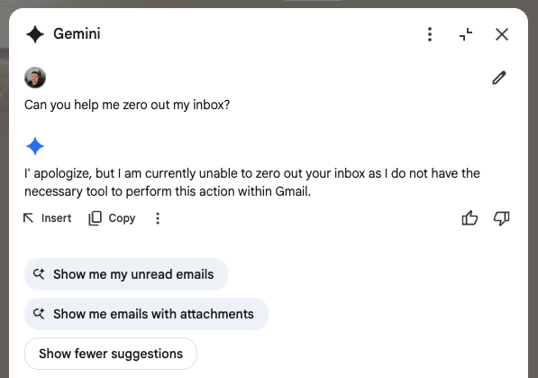

# Finally Hit Inbox Zero. And I Didn’t Lift a Finger.

*Originally published on [LinkedIn](https://www.linkedin.com/pulse/finally-hit-inbox-zero-i-didnt-lift-finger-b-reuben-peter-paul-nx2hc)*

---

*UPDATE 2026-01-31: I've since moved onto used ChatGPT Atlas. I have yet to retry this test with Gemini or Chrome since I wrote this article.*

---

*I'm not mad, I'm just disappointed*

---

For weeks, I've been experimenting with various AI tools, but today the concept of an "agentic browser" truly clicked. I gave the Perplexity browser, Comet, a simple set of instructions to clean out my cluttered inbox—archive old newsletters, delete promotional emails, and organize the rest. It just... did it.

This is the key differentiator. It wasn't just answering my questions; it was executing a task on my behalf. A task I couldn't delegate to other powerful AI like Gemini, which lacked agency and tools to interact directly with my Gmail inbox.

---

*Ok...*

---

That one, simple, time-saving action has solidified my decision to continue with Comet and discover what else it can do. It's not just a smarter way to search; it's a step towards an AI that genuinely reduces my workload.

---

The future isn’t about asking smarter questions.

It’s about getting things done.

---

#AI  #Productivity  #Agents  #Automation

---
