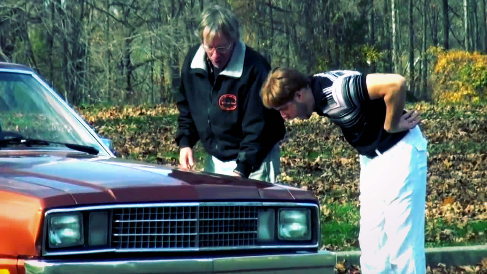

# uv Is the New “It Just Works” for Research Projects

*Look at it. Clean sync. Reproducible env. No ritual sacrifice required.*

There are two kinds of project pain:

1. Hard problems you expect
2. Environment problems you pretend are normal

I have deep respect for hard problems.

I have zero patience left for the second category.

After resetting `friendly-rotary-phone`, I moved dependency and workflow management to `uv`, and the impact was immediate:

- predictable setup with `uv sync`
- clean execution paths (`uv run pytest`, `uv run jupyter lab`)
- fewer “works on my machine” conversations
- less cognitive overhead before doing actual thinking

That last one matters most.

In research-heavy work, your best hours are fragile. If your first 45 minutes go to environment archaeology, your best ideas often don’t survive the day.

`uv` doesn’t make your model better.

It makes your attention available.

---

My current default for experimentation projects:

- `pyproject.toml` as source of truth
- `uv` for environment + dependency operations
- notebooks for exploration, tests for invariants, CI for honesty

If your stack is fighting your thought process, it’s not “developer grit” to endure it. It’s usually a sign the project needs less ritual and more flow.

---

No fireworks here. Just fewer papercuts.

And more shipping.

#Python #uv #DeveloperExperience #Productivity #Research
